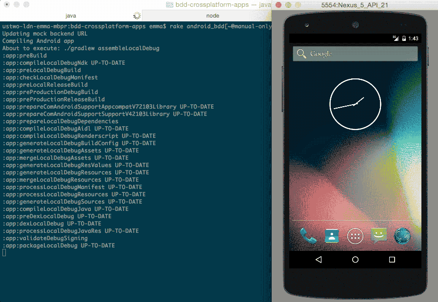

# BDD crossplatform applications

A handy guide by the [ustwo](http://ustwo.com) engineering team.

You can get in touch for ideas, feedback or comments at open.source@ustwo.com or drop by the [BDD channel at Slackline](http://slackline.io/shared_channels/bdd).

## Introduction

At ustwo we define, design, build and test digital products.

We think collaboration is key to putting together amazing products and we have found in BDD a perfect excuse to make that collaboration happen.

The setup we describe here is what underpins the process from a technical point of view. We don't claim it's perfect or the only way of doing it, it's simply how *we* do it. One of the expected outcomes of making it public is gathering feedback and improving it. So yeah, we are all ears.

Please keep in mind that test automation is "only" a side effect of practicing BDD. A very valuable one, of course, but if you are only doing test automation and not collaboration you are missing out big time. Read more about it in [Are you doing BDD? Or are you just using Cucumber?](https://cukes.info/blog/2015/03/24/single-source-of-truth)

The opposite is also true. Just because you can't automate a test (tool limitations often prevent you from full automation) it doesn't mean that you shouldn't write the corresponding BDD scenario in collaboration with the team. Scenarios also serve as manual test specs and future improvements to automation tools might allow their implementation.

### What this is about

A reference for a project setup that enables:

 * Collaboration, particularly with non-technical people.
 * Visibility over the development process.
 * Robust client-side applications.
 * Faster and cheaper testing of cross-platform applications.
 * Faster, cheaper integration with backend.

### What this is not about

 * Not a tutorial about BDD or Cucumber.
 * Not about testing backend applications.
 * Not creating elaborate iOS or Android apps. We've deliberately kept things as simple as possible to minimise the risk of distracting from the bigger picture.
 * Not an end-to-end testing setup.
 * Not a project template that you can clone, modify a few values on a configuration file and get your project up and running quickly.

### Audience

This document and repository are intentended for technical people involved with automated functional testing, typically developers and testers.

While it should be approachable for the less technical folks, it helps having some knowledge of platform tools, architecture of client/server applications, being comfortable with the terminal, etc. 

### Next steps

 * [Install dependencies and set up](docs/setup.md).
 * [Run the tests](docs/running_tests.md).
 * [Dig deeper into what's going on](docs/overview.md).
