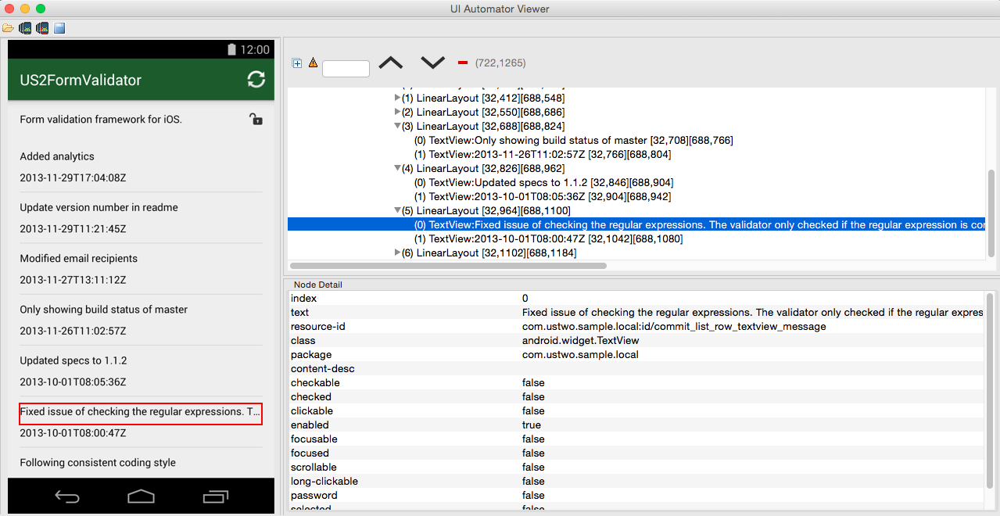

## Main actors

 * Mobile app (iOS/Android) as the application under test.
 * [Sinatra](http://www.sinatrarb.com/) as our local mock server.
 * [Cucumber](https://cucumber.io/) as the BDD tool of choice.
 * [Appium](http://appium.io/) as the functional automation framework.

### The application under test

We assume that the application solves the same business problems in all platforms, which naturally leads to similar interfaces. However, this setup still leaves room for some platform specific differences, see the Cucumber section below.

Ideally the application needs little code or modification for the purposes of testing. Appium doesn't require adding testing specific libraries to the code, keeping the application as close as possible to what will be released, hence reducing the risk of unexpected behaviour only showed (or avoided) during testing. 

The app in this sample is a simple one: go to a specific repository on GitHub, show its description, an icon to see if it's public or private and a list of the most recent commits. If you tap on one of the commits, it takes you to a details screen, where you can see further information about that commit.


### Mock backend

Most client side applications are driven by data, typically coming from several sources. What happens on the client is mostly dictated by the data the server feeds it.

So if we are going to thoroughly test how client side applications behave, particularly in non-ideal scenarios, then we need full control of what data the server is giving them.

Other ways of achieving a similar outcome are using services like [Apiary](http://apiary.io/), staging servers or local development servers. We think a mock server that is a drop-in replacement for the real API offers advantages over those methods: simpler, lightweight, more flexible.

For example, imagine that we need to test how our application behaves when the server returns a 500 error for an API call. Forcing this on an instance of the real server, even if it's running locally, is not straightforward. Sometimes fronted teams don't even have the possibility of locally running the backend (complicated dev environments, belongs to a 3rd party, software licenses, etc).

This is where a local mock backend excels. It's very easy from a Cucumber step definition to force the mock backend to return a 500 error for a given API call, then assert in another step that the application is handling the error as expected (displaying an appropriate error message, for example).

Forcing specific responses, statuses or content types in the mock server is done via a "backdoor" API. This API, obviously, wouldn't be part of a production server, but it is what gives its flexibility (and helpfulness) to the local mock server.

The downside of the mock server is mostly the manual effort required to keep it in sync with the signature of the real API.

We always try to avoid implementing business logic in the mock backend and limit it as much as possible to returning static resources (JSON, images).

The mock server can not only be used during the normal test runs, it can also be run on its own during development and [interactive sessions](running_tests.md#writing-new-tests). This again simplifies testing against edge or very specific cases by modifiying a JSON response, forcing a HTTP status code, etc.

Simply run the Rake task below to bind the mock server to your local IP address:

```bash
rake boot_mock
```

### Cucumber

We consider Cucumber to be an essential part of the workflow. The benefits it brings in terms of collaboration far exceed the complexities it adds from a technical point of view over other lower level, platform specific options.

Cucumber scenarios are written in plain text enabling tests written in a language that is very close to the domain problem ([DSLs](http://martinfowler.com/bliki/BusinessReadableDSL.html)). This increases the chances of engaging non-technical people and reduces the chances of misunderstandings.

We favour [declarative vs imperative](http://itsadeliverything.com/declarative-vs-imperative-gherkin-scenarios-for-cucumber) tests and use [page objects](http://developer.xamarin.com/guides/testcloud/calabash/xplat-best-practices/) (POs) so the testing codebase is highly reusable across platforms. This combination also enables platform specific implementation of behaviours. For example, selecting an item on a list could be implemented as a swipe on iOS and as a press on Android.

Step definitions are kept free of UI and automation framework specifics, making them easier to read and less brittle. The complexities of extracting information or interacting with the interface are kept inside the page objects. We aim for "*clean steps and dirty POs*".

For more information about the choices and trade-offs of the testing codebase please read the [in-depth code comments](testing_codebase_comments.md).

### Appium

We use Appium since it provides a cross-platform set of APIs for test automation. It's built on top of the [JSON Wire Protocol](https://code.google.com/p/selenium/wiki/JsonWireProtocol) making it easier to find testers with at least some familiarity with its APIs.

But please keep in mind that like any abstraction layer, it also has its downsides, particularly around stability, speed and features.

We personally feel that, currently, it has more pros than cons and that the time spent maintaining different platform specific testing codebases can be used to improve and contribute back to a cross-platform tool.

## How it works

Here's a high level overview of the tasks required to run the tests:

 * Generate a platform specifc configuration file with the base URL for the API/backend so the app is not hardcoded to the production URL. The configuration file contains the local IP address of the machine running the tests since the app can't use ```localhost``` because **on a device ```localhost``` resolves to the device itself**.
 * Compile the app.
 * Write the Appium configuration file.
 * Boot up a local Appium server, if required.
 * Boot up a local mock server, if required. The mock server is bound to local IP address defined above.
 * Run Cucumber.

At this point it is Cucumber business as usual, for example:

 * Define which data is going to be given to the app : ```Given there are no commits in the repo```.
 * Launch the app, take it to the point we want to test: ```And I am on the commit list screen```.
 * Assert the expected behaviour: ```Then we should see the no commits indicator```.
 
The first step uses the mock backend backdoor API to force a specific server response: no commits.

The second step uses Appium to install and launch the app. Because the commit list screen is the first in the app there is no need to navigate to it (pressing buttons, filling forms or whatever might be necessary).

The third step uses Appium API's to assert that the right error message is on screen.

## Tips and tricks

You can keep instances of the mock backend and the local Appium server running on their own tabs so consecutive test runs are faster and there is less noise on the terminal running the tests.

At the end of each scenario there's a list of the API calls made to the mock during that scenario. Over time this helps spot mistakes around missing or unexpected API calls.

## Limitations, considerations

### Appium limitations

### Not end to end testing

Thorough testing of client side applications does not guarantee that there won't be integration issues with the backend. It doesn't completely replace integration tests.

An API is just a contract that defines the signature of the communication between 2 systems. Both systems can comply with the contract and still have trouble working together. This typically happens when there are assumptions about the business logic implemented by the other system.

This is why we encourage development across the stack and [staying shippable](http://tech.ustwo.com/2014/10/15/the-definition-of-done-and-staying-shippable/) as soon as possible.

The risk of integration, however, can be reduced by using a subset of the BDD tests for end-to-end tests, using the real application server and the real application under test. Most of the times this subset of tests require a database seeded with a known dataset so the tests can make certain assumptions.

### Always put time aside for exploratory testing

Even assuming that 100% automation coverage would be feasible (it's not, particularly on mobile devices), is important to do some exploratory testing so please always plan accordingly. 

### Technical limitations

Some scenarios are more difficult to implement than others. It's good to strike a balance - if a particular scenario contains something that's very tricky to automate and may end up being flakey and require some serious maintenance in the future, consider whether the cost of this automation is actually more than the time taken to manually QA - if it's a UI thing, chances are it could be cheaper and easier to have a person check it rather than take the hit trying to automate it. Not saying that it's not worth having a go automating it, but just something to be mindful of.

In this sample, we've tagged the 'commit message is too long' scenario as ```@manual-only``` to indicate that it needs to be tested manually. Automating this was very challenging - the scenario verifies that if a commit message is very long, the text becomes ellipsised and truncated, so that each row in the list will be the same height. If we call the 'text' method in Appium on the element, it retrieves the entire string, regardless of the fact the string that's visible to the user is on a single line and correctly ellipsised.

UIAutomator, which is what Appium uses on newer versions of Android, only exposes the full text rather than the ellipsised text, which explains why Appium does the same.


Manual scenarios can be considered technical debt. As a team, we can choose to build up some debt in the form of manual testing AS LONG AS we know we are going to be paying for it whenever we want to release. In this case "paying" comes in the form of longer lead times to release seeing as there's a bigger list of manual tests that we must go through, on all devices, before we can be sure there is nothing broken. 

Additionally, automation tools are improving all the time so in subsequent versions something marked as manual test today because of technical limitations might be possible to automate in the future.

To find all scenarios tagged as manual only you can try running the following: ```grep -ir "manual-only" features/```

## Links

Appium uses [UIAutomator](http://developer.android.com/tools/help/uiautomator/index.html) (Android) and [UIAutomation](https://developer.apple.com/library/ios/documentation/DeveloperTools/Conceptual/InstrumentsUserGuide/UsingtheAutomationInstrument/UsingtheAutomationInstrument.html) (iOS) so it will always be bound by their APIs.

Appium [concepts](https://github.com/appium/appium/blob/master/docs/en/about-appium/intro.md), [documentation](https://github.com/appium/appium/tree/master/docs/en) and [finding elements](https://github.com/appium/appium/blob/master/docs/en/writing-running-appium/finding-elements.md).

[Writing testable code](http://misko.hevery.com/attachments/Guide-Writing%20Testable%20Code.pdf) (2008, PDF).


